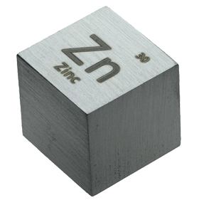

# Zinc

Oh no! Another web server…

So, what's the point? This one is designed to be small and portable. It requires no installation and no configuration. It can even run from a USB stick. Just start it from the command line in the root folder of your web site, et voilà! Plus, it offers logging options that prove useful when debugging a web service. Its architecture also allows for easy reuse of the HTTP layer in another application.

Typical use cases for `zinc` are when you need to prototype a small site locally, or when you want to share a folder on your intranet, and don't want (or can't) install a full Apache/PHP stack. I also successfully embedded this server in several projects where I needed a small HTTP server.

The `zinc` server runs on all UNIX flavours (Linux, macOS, FreeBSD, etc.) and Windows.

By the way, you may ask: why the name? Well, I started working on this project in February 2019 when everybody was about to celebrate the 30th anniversary of the World Wide Web, and 30 is the atomic number of the zinc metal.

*Warning: this web server is designed for prototyping and local usage only. It does not implement safety features, it does not scale well, it is not resilient, it does not restart automatically after a crash. You must never use it in production.*

## Features

`zinc` is not intended to be used in production. It does not implement all the nifty features you may expect from a "real" server, but only features that are required to prototype and debug a small site locally:

* Support for GET, HEAD, POST, PUT and DELETE verbs
* Connection keep-alive
* Last-Modified and If-Modified-Since mechanism to allow browser side caching
* Chunked transfer encoding
* Response compression (Gzip, Deflate and Brotli)
* Basic automatic MIME type guessing, including determining the charset for text/*
* Server-generated directory listing when browsing a folder with no index file
* CGI (with automatic configuration for PHP and Python)
* Detailed logs
* Experimental support for the WebSocket protocol (see RFC6455)

What it *does not* implement (yet):

* WWW authentication
* Request compression
* HTTP/2.0
* IPv6
* FastCGI, SCGI
* SSI
* TLS/SSL
* Compatibility with Apache's `.htaccess` and `.htpasswd`

What it will *never* implement:

* Virtual hosting (because it does not match the `zinc` philosophy of just serving the current folder without any further configuration)
* Security features (because it would involve a lot of work for a feature that is not decisive for a server intended for local usage only) 
* Java Servlets, ISAPI and other vendor-specific technologies

## Installation and usage

Download the executable file for your plateform in the Release tab, rename it to `zinc` and copy it in a folder where your shell can find it. On most Linux and macOS systems, `/usr/local/bin` or `/usr/bin` will do. You can also put it elsewhere (for example on a USB stick) but you'll have to type the full path to launch it. If necessary, ensure everybody has execute permission on the file. Then:

* open a terminal
* cd to the root folder of the site you want to serve
* launch `zinc`

The server prints some information on the terminal and starts listening to port 8080. You can now navigate your site at `http://127.0.0.1:8080` or `http://localhost:8080` in your favorite browser.

To stop the server, type Ctrl+C in the terminal, or send the `zinc` process a SIGTERM from another console.

## CGI scripts

At startup, `zinc` explores your system (to be specific: it explores the folders listed in your `PATH` environment variable) to find interpreters for PHP and Python. When an interpreter is successfully found, requests for files with the corresponding extension are treated as CGI scripts and passed to this interpreter.

Note: the PHP module that implements the CGI interface is named `php-cgi` and it is not installed by default on most systems. You may have to install it manually if you want to serve PHP scripts. On Debian/Ubuntu: `sudo apt-get install php-cgi`, on macOS: `brew install php`. On Windows, this module is named `php-cgi.exe` and it seems to be installed by default.

You can extend `zinc` to execute scripts in other languages. See the Configuration section below.

## Logs

The server prints logs on the terminal as requests arrive and are being processed. You can set the log level at startup with the -l option. (See below.) Available levels are:

Level | Description
------|------------
none  | No log.
error | Log errors only.
info  | Log errors and requests being processed.
debug | Log detailed informations about requests and responses (raw headers)
trace | Full log. This is mostly used to debug the server itself.

Moreover, you can also dump all of the request and response bodies by specifying the -b option at startup.

## Configuration

All configuration parameters get sensible default values at startup. However, if a `zinc.ini` file is present in the current folder, then the parameters in this file override the default values.

The simplest way of creating a `zinc.ini` file is to launch the server with the -c option. This generates a template file you can edit and customize manually. The file structure follows the usual syntax of INI files: *key=value* pairs grouped in several *[sections]*. The exact content depends on your system configuration; on my computer, the generated file looks like this:

```
[Server]
Listen = 8080
LimitThreads = 8
LimitRequestLine = 2048
LimitRequestHeaders = 8192
LimitRequestBody = 33554432
Compression = yes
DirectoryIndex = index.html index.xhtml index.htm index.php index.py
DirectoryListing = yes
Timeout = 15
Expires = 3600
ServerAdmin = admin@pascal-macbook.local
ServerName = pascal-macbook.local

[PHP]
Extensions = php php7
Interpreter = /usr/bin/php-cgi
CmdLine = 

[Python]
Extensions = py
Interpreter = /usr/bin/python
CmdLine = 
```

The *[Server]* section gathers general parameters:

Option              | Description
--------------------|------------
Listen              | Port the server listens to. (Default is 8080.) You can also change this parameter from the command line.
LimitThreads        | Number of threads the server uses to process incoming requests.
LimitRequestLine    | Maximal length (in bytes) of the request line.
LimitRequestHeaders | Maximal length (in bytes) of the request headers.
LimitRequestBody    | Maximal length (in bytes) of the request body. You may want to increase this limit if your site contains a file upload form.
Compression         | Enable/disable compression. Default is on. You may want to disable compression to trace more easily HTTP transactions in a debugging proxy.
DirectoryIndex      | List (space separated) of index files the server tries to load when the user browses a directory.
DirectoryListing    | Enable/disable directory listing. If enabled and the user browses a directory that does not contain a suitable index file, the server generates a directory listing on-the-fly.
Timeout             | Timeout in seconds. You may need to increase this value if you are working on CPU intensive scripts on a slow computer.
Expires             | Interval in seconds after the browser must consider that its cached version of a resource is stale.
ServerAdmin         | Email address of the server administrator. You may want to customize this address because some scripts use it to determine whether they are running on a test or a production environment.
ServerName          | Domain and server name. Same as above.

After this general section comes one section for each supported script language. For each language, the following parameters are available:

Option      | Description
------------|------------
Extensions  | List (space separated) of extensions for this language. The server uses this value to determine from its filename which interpreter to spawn to execute a given script.
Interpreter | Absolute path to the interpreter.
CmdLine     | Extra parameters to pass to the interpreter.

You can add as many language sections as you want. Note that section names are meaningful: some languages require specific processing and `zinc` uses this name to determine whether they apply or not. (For example, `php-cgi` requires that REDIRECT_STATUS and PHP_SELF environment variables receive specific values, but other interpreters do not.)

## Command line options

Zinc supports the following command line options:

Option     | Description
-----------|------------
-p *num*   | Listen to port *num*. Valid port numbers range from 1024 to 65535.
-c         | Generate a `zinc.ini` template file in the current folder. You can then edit this template to customize the various server parameters.
-n         | Do not load the zinc.ini file at startup, even if present, and run the server with default values for all parameters.
-q         | Suppress display of the banner at startup.
-l *level* | Set the log level. From the least to the most detailed, log levels are: none, error, info, debug, and trace.
-b         | Log request and response bodies. (In clear text, i.e. before content and transfer encoding apply.)
-a         | Do not emit ANSI escape sequences in the log. (Monochrome output.)
-h         | Display an help screen that summarizes available options.

## Building zinc from sources

Zinc is a C++14 cmake based project. To build it, you need `cmake` version 3.9+, the regular `make` tool and any C++ compiler/toolchain for which a cmake generator is available. On UNIX-like systems:

* Clone the repository on your local computer: `git clone https://github.com/PascalLG/zinc-cpp.git`
* Move to the folder `git` just created: `cd zinc-cpp`
* If necessary, adjust the options at the beginning of the ``CMakeLists.txt`` file (see below)
* Create a build directory and jump into it: `mkdir build && cd build`
* Configure the project for a release build: `cmake -DCMAKE_BUILD_TYPE=Release ..` You need network connectivity at this point, as this downloads a few external libraries from GitHub.
* Build the project: `make`

When using the MSVC toolchain on Windows, the procedure is similar except that `cmake` generates a Visual Studio solution. Just double-click the `zinc.sln` solution file and build it like any other solution. If you'd rather build on the CLI, add the `-G "NMake Makefiles"` to the `cmake` command line to generate a regular makefile you can build with `nmake`. Refer to `cmake` documentation for more information.

If the build is successful, you end up with two executable files in the build folder. The `zinc` file is the server itself, while the `ut` file is a command line application that runs unit test suites on various parts of the server code.

At the beginning of the main ``CMakeLists.txt`` file, you'll find some options to fine-tune your server:

Option                    | Values      | Description
--------------------------|-------------|------------
ZINC_VERSION_MAJOR        | any integer | Version major number
ZINC_VERSION_MINOR        | any integer | Version minor number
ZINC_COMPRESSION_GZIP     | ON or OFF   | Enable/disable gzip compression
ZINC_COMPRESSION_DEFLATE  | ON or OFF   | Enable/disable deflate compression
ZINC_COMPRESSION_BROTLI   | ON or OFF   | Enable/disable brotli compression
ZINC_WEBSOCKET            | ON or OFF   | Enable/disable websocket support. (See below.)

When a compression scheme is enabled, the corresponding library is automatically downloaded from GitHub, built, and statically linked with the server code. The WebSocket support is somewhat experimental and is only useful when embedding `Zinc` in another application, where you can implement the required callback to respond to WebSocket messages.

The `www` folder contains a test web site, with scripts to process forms in PHP and Python. For easy testing, just symlink it from your build folder: `ln -s ../www www`, launch `zinc` and go to `http://127.0.0.1:8080/www/` in your browser.

<p align="center">
  
</p>
